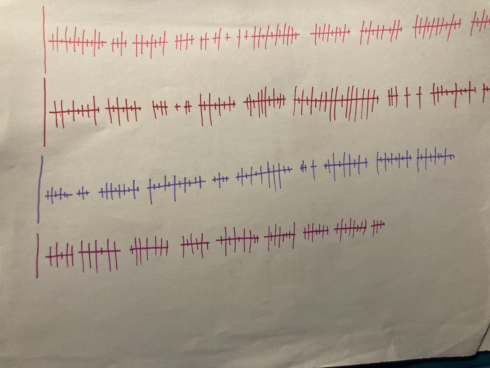

# Shakespeare Visualization,

_The following is part of a project I made for my information visualization class_

Link to site: https://sabrinatt7.github.io/information-visualization-shakespeare/

### Description

I am visualizing the number of lines per play in all of Shakespeare's plays and then the breakdowns of lines per character. Since the scale is off and most of the choices I made for this visualization are aesthetics, this is more along the lines of visualization art. While you can read names of plays and characters from the tooltips, the best and primary way to interact is by hitting the randomize button, which will randomize the order of both the list of plays and the list of characters, therefore continually presenting the same information in hundreds of different aesthetic ways.

### Design Rationale

- I wanted to explore the more vis art side of visualization, since I'm always looking for the design tech intersectional space. I chose Shakespeare data primarily because Shakespeare is near and dear to my heart (I spent a lot of time doing Shakespeare performances in high school, and loved every second of it), but also because I think it is well-known enough that it makes a cool basis for vis art. 

- I then found the one Shakespeare dataset that I could and thought about what I could represent with the relatively simple column structure. I settled on line counts and thought representing them as intersecting or perpindicular bars would be a good way to show multiple types of counts at once and perhaps end up with something visually pleasing. I confirmed that this approach would look good aesthetically with a few sketches.

- I decided to scale the play line counts and character line counts differently since they represent the same number, just broken up in different ways, and it did not feel like an efficient use of space to scale the play bars to be full length. 

- I made a custom glyph for the vertical bars so that they look slightly like old-timey book titles. This brings in more of a visual element specifically connecting to the Shakespeare theme. 

- I designed a custom dataset which maps each play to a specific hex value. I tried to get a relatively even disttibution of different colors, but I also hand-picked each color to have some sort of associated meaning for the plays. This may be a color mentioned in a play- the color fallow is apparently mentioned in Merry Wives of Windsor (according to a book I own, "The Secret Lives of Color" to which I owe much of this information on color), jealousy is identified as a green-eyed monster in Othelllo, so Othello is emerald green. Some colors are in relation to a feeling or theme, for which I researched color associations. Some of them are more subjective than others, and a lot of it is based around my experience or knowledge of the plays. For example, I was the messenger in Henry V, and therefore strongly associate Henry V with the tennis balls scene and so colored it accordingly. I stumbled upon a color called Tyrian Purple in my book, and that seemed perfect for Pericles since it is set largely in Tyre. So while some of the connections or associations are thinner than others, they are all carefully curated by me for this purpose. I prioritized this connection over 'beauty' of the color in some cases, since while this is supposed to be aethetic it holds more aesthetic meaning if connected to the data. 

-I chose not to make the vertical lines the same color as the lines they are associated with because it made the overall picture annonyingly busy. Instead, I opted for a blue color which is named Shakespeare :)

### Overall process

As part of the process, I drew the following image. My idea progressed since then, and a couple of changes were made along the way. 

I got rid of the tiny vertical lines partly because they were difficult to implement and partly because they seemed to be not worth it for the information or aesthetic they provided.

Instead, I developed an interaction that reorders everything on the page. I really liked this interaction! Which I will talk more about in a second. I also added the book glyphs which I think are cute and made intuitive sense as a next step to me from looking at where I was. 

